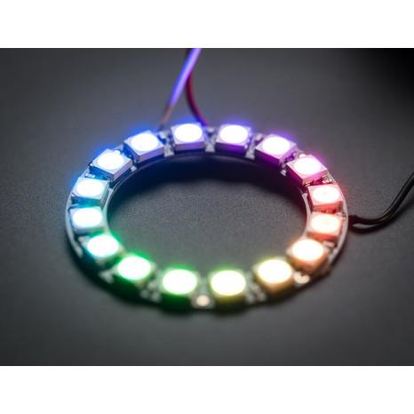

[Watch video here](https://www.youtube.com/watch?v=GRqZQ8ZZVxc)

# Parts List:

#### Adafruit Flora microprocessor

[Maplin Electronics](http://www.maplin.co.uk/p/adafruit-flora-wearable-electronic-platform-arduino-compatible-n83dp) 		£15.99

[RS Components](http://uk.rs-online.com/web/p/processor-microcontroller-development-kits/9054605/) 		£15.46

#### Piezo transducer

[Maplin Electronics](http://www.maplin.co.uk/p/3v-ceramic-piezo-transducer-2718-yu87u) 		  £1.39

#### USB charger 2600mAh

[Amazon](https://www.amazon.co.uk/PowerBank-Portable-Battery-Charger-Blackberry/dp/B00IXGDSUM/)			 £4.99

NB: before Brexit these were less than half price :Õ(

#### USB to mini (not micro!) USB cable

[Bluechargedirect](http://www.ebay.co.uk/itm/like/351640949914)		 £0.99

For drums:

#### Waterproof Neopixel Strip 30LEDs/m

(1m should be enough for the circumference of a caixa, hep or timba - you may need more for surdos or more elaborate patterns)

[Happychrisji](http://www.ebay.co.uk/itm/181724643383) (China)		£20.86 per 5m

[Chinly2012](http://www.ebay.co.uk/itm/5meters-DC5V-30LED-M-WS2812b-led-strip-30IC-M-SMD5050-led-IP67-waterproof-/251985318806?_trksid=p2141725.m3641.l6368) (China)		£17.24 per 5m

[Makersify](https://makersify.com/collections/neopixels/products/adafruit-neopixel-digital-rgb-led-weatherproof-strip-30-led-1m) (UK)		£16.00 per 1m(!)

[Proto-PIC](https://www.proto-pic.co.uk/neopixel-digital-rgb-led-weatherproof-strip-30-led-1m-white.html?gclid=CPzj_pP07s0CFVIaGwodkGQPXg) (UK)		£14.82 per 1m(!)

Alternatively, for glasses:

#### 2x Neopixel rings

[czb6721960 ](http://www.ebay.co.uk/itm/2Pcs-WS2812B-5050-RGB-LED-Ring-16Bit-RGB-LED-Integrated-Drivers-For-Arduino-/141959873239?hash=item210d77c2d7:g:8wUAAOSwhOVXdJP9)(China)		  £4.31

[Cool Components](https://www.coolcomponents.co.uk/neopixel-ring-16-x-ws2812-5050-rgb-led-with-integrated-drivers.html)		£15.98

[CPC Farnell](http://cpc.farnell.com/adafruit-industries/1463/neopixel-16-rgb-led-ring-w-drivers/dp/MK00277)			£15.98

#### Cables

#### 

I used a combination of CAT 5 cable I had kicking about and m/f DuPont wires to create detachable connectors.

# Circuit Diagram:

# Code
## Dependencies:
* [Arduino IDE](https://www.arduino.cc/en/Main/Software)
* [Adafruit Board Support Package](https://learn.adafruit.com/adafruit-arduino-ide-setup/arduino-1-dot-6-x-ide)
* [Arduino Light Animation (ALA) library](https://github.com/ssured/ALA)

[Download the code here](https://raw.githubusercontent.com/axwax/arco_lights_flora/master/arco_lights_flora.ino)